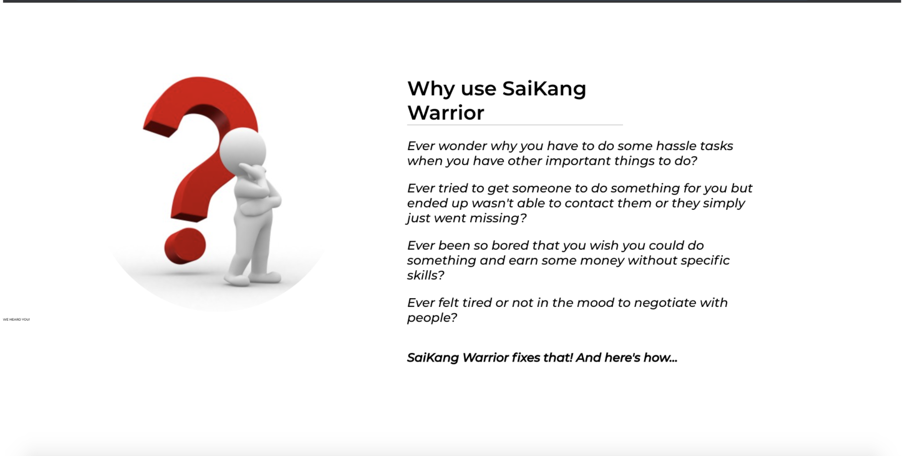
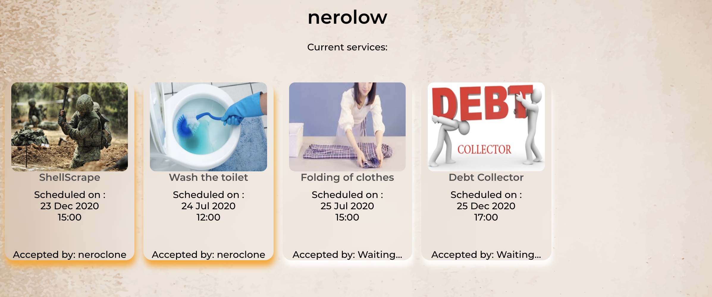
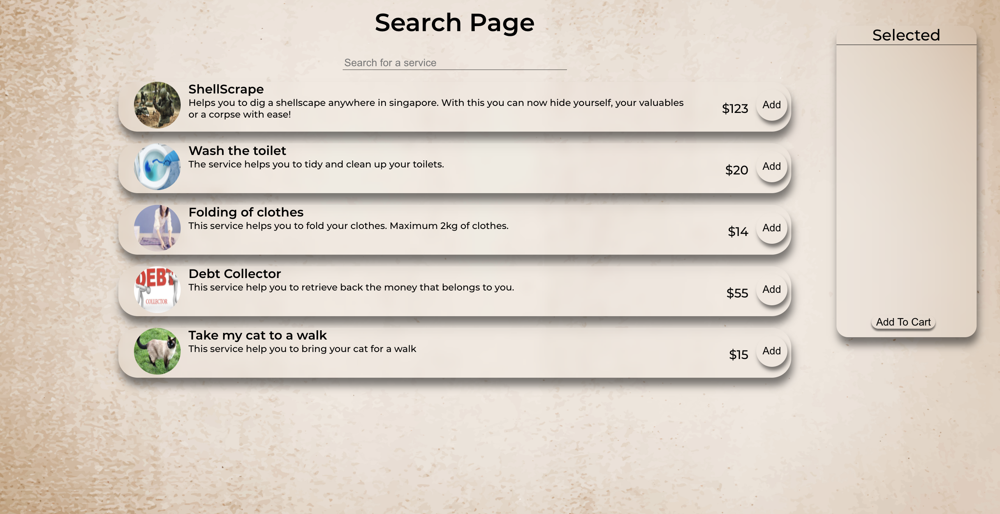
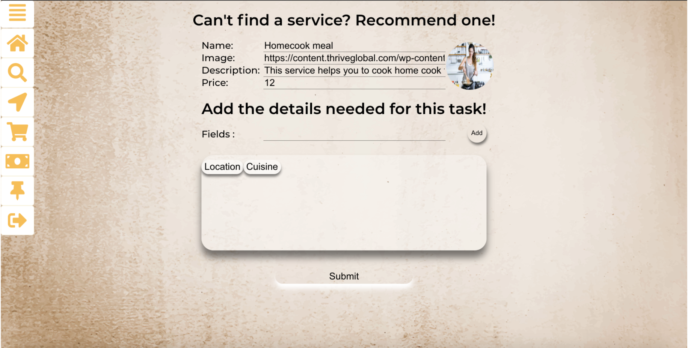
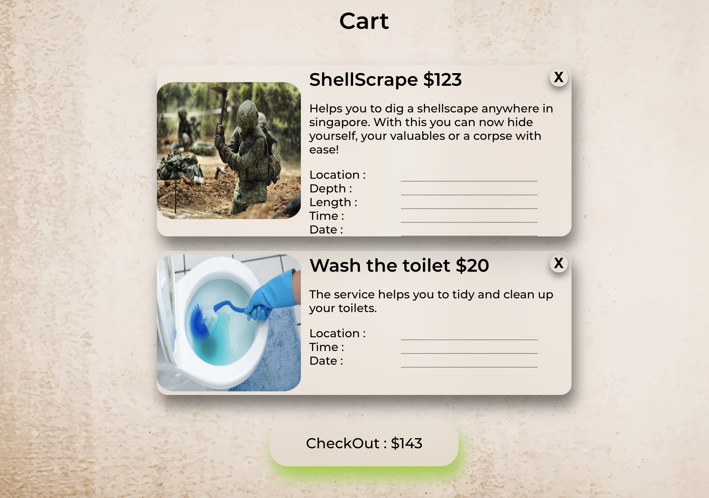
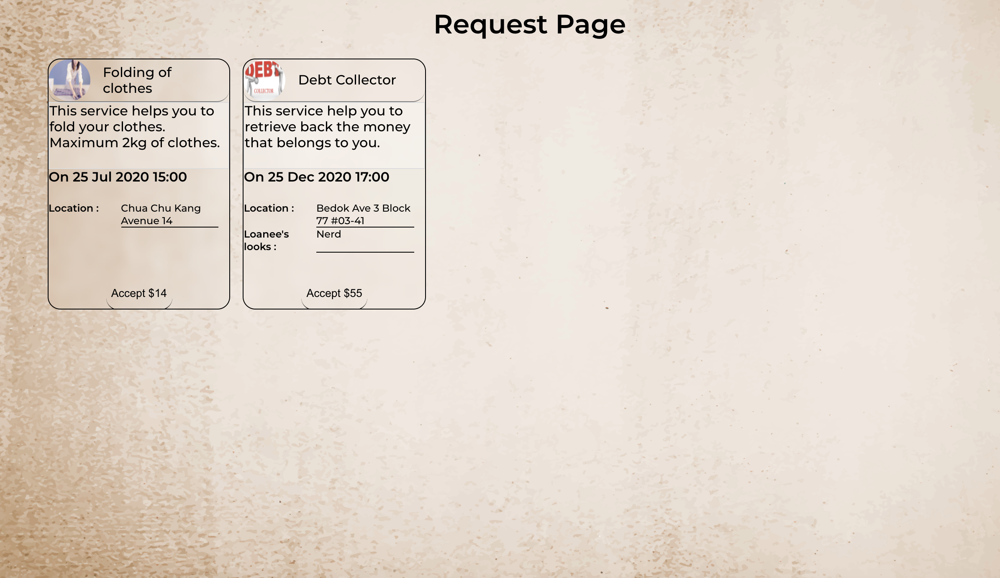
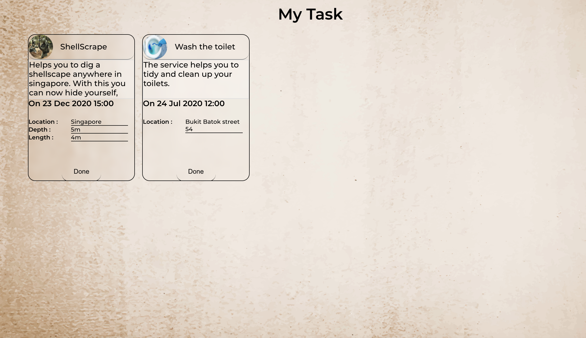

# Goal Keeper 

## Description
SaikangWarrior is a "service Ecommerce"

## Technical Used
Technologies implemented in this project are as followed :
- React
- SASS
- AOS
- Axios
- MongoDB

## What is SaikangWarrior
Saikang warrior is a platform that provides users the opportunity to do task or get their task completed by random people around singapore.
If the user is looking for someone to complete a certain task, he can look into the search category where all the services are listed, and pick the one 
that suits his needs. However, if the service is not avaliable user can suggest their "service" to the platform.
If the user is looking to earn some money, he can look for available requests listed and select the one that he is comfortable to do when both party have confirmed
the service completed, the transaction ends.

## WalkThrough

User will first land on the welcome page and have an understanding how the app works.

After the user has logged in, they will be able to see tasks they have requested to be completed. 
They wil also see which user have picked up their task.

Services can be bought through the "service page"

If the service that user wants is not available, they can recommend to us!

Fill up the necessary fields for the task. So the other user can have more details on the task.
And you are done! You service will be fulfilled.

If you want to earn some money pick up some task here!

Once you are done with your task, click on completed and wait for approval.

## Planning and Development Process
Went through multiple brainstorm and finalized on this idea. The UI/UX design was not properly thought out before execution, prototyping if the function works come first before the design.

## Problem-Solving Strategy
Google, youtube, past works and asking for help.

## Unsolved problems
UX/UI design is not up to standard.

## APIs Used
Nil
